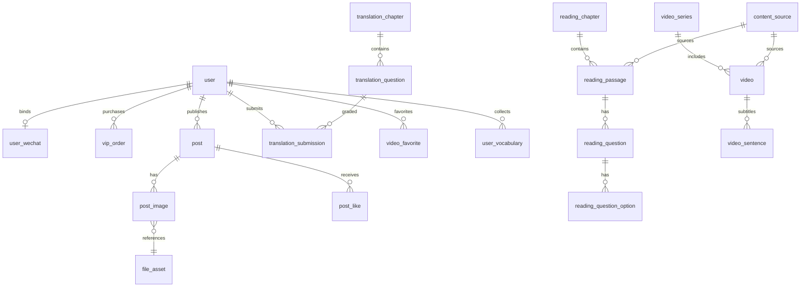

# ISLAND 库表设计说明

> 配套可执行 DDL：[库表设计.sql](./库表设计.sql)  
> 版本：v1.0 | 数据库：MySQL 8.0+ | 字符集：utf8mb4

---

## 1. 设计原则

| 原则 | 说明 |
|------|------|
| MVP 优先 | 单体够用，不为微服务过早拆表 |
| 合规可追溯 | 题目 `is_mock`、视频 `content_source` + `license_note` |
| VIP 可扩展 | `user.vip_level` + `vip_order`，MVP 可手动改库测 VIP |
| 视频双模式 | `storage_type`: `embed`（MVP）→ `oss`（后期 4K 自建库） |
| 社区约束 | 帖子仅文字；图片走 `post_image` → `file_asset`，无视频/外链字段 |
| 软关联 | 章节与练习题 `chapter_id` 可空，便于独立维护 |

---

## 2. ER 关系概览



---

## 3. 表清单（共 26 张）

### 用户与 VIP

| 表名 | 用途 | MVP |
|------|------|-----|
| `user` | 用户主表、VIP 状态 | ✅ |
| `user_wechat` | 微信绑定 | 第二期 |
| `vip_plan` | VIP 套餐 | 预留 |
| `vip_order` | 支付订单 | 第二期 |

### 文件与合规

| 表名 | 用途 | MVP |
|------|------|-----|
| `file_asset` | 上传文件元数据 | ✅ |
| `content_source` | 内容来源合规 | ✅ |

### 阅读

| 表名 | 用途 | MVP |
|------|------|-----|
| `reading_chapter` | 技巧章节 | ✅ |
| `reading_passage` | 练习篇章 | 可选 |
| `reading_question` | 阅读题 | 可选 |
| `reading_question_option` | 选项 | 可选 |
| `user_reading_progress` | 章节进度 | 可选 |

### 翻译

| 表名 | 用途 | MVP |
|------|------|-----|
| `translation_chapter` | 技巧章节 | ✅ |
| `translation_question` | 练习题 | ✅ |
| `translation_submission` | AI 批改记录 | ✅ |

### 词汇

| 表名 | 用途 | MVP |
|------|------|-----|
| `vocabulary` | 词汇库 | 第二期 |
| `sentence_pattern` | 搭配句式 | 第二期 |
| `user_vocabulary` | 生词本 | 第二期 |

### 双语视频

| 表名 | 用途 | MVP |
|------|------|-----|
| `video_series` | 视频专栏 | ✅ |
| `video` | 视频主表 | ✅ |
| `video_sentence` | 句级字幕轴 | ✅ |
| `video_favorite` | 收藏 | ✅ |
| `user_video_progress` | 学习进度 | ✅ |

### 社区

| 表名 | 用途 | MVP |
|------|------|-----|
| `post` | 帖子 | ✅ |
| `post_image` | 帖子图片 | ✅ |
| `post_like` | 点赞 | ✅ |
| `post_comment` | 评论 | 第二期 |

### 系统

| 表名 | 用途 | MVP |
|------|------|-----|
| `admin_audit_log` | 审计日志 | 可选 |

---

## 4. 核心字段说明

### 4.1 用户 VIP

```text
vip_level = 0  → 普通用户
vip_level = 1  → VIP（且 vip_expire_at > NOW()）

权限校验逻辑：
  isVip = vip_level >= 1 AND (vip_expire_at IS NULL OR vip_expire_at > NOW())
```

MVP 测试 VIP：直接 UPDATE user SET vip_level=1, vip_expire_at='2026-12-31' WHERE id=1;

### 4.2 视频存储扩展

| storage_type | provider | 播放方式 | 字段 |
|--------------|----------|----------|------|
| `embed` | bilibili | B 站 iframe | `embed_bvid`, `source_url` |
| `embed` | youtube | YouTube iframe | `source_url` |
| `oss` | self | HTML5 video | `play_url`（CDN） |

B 站 Embed 示例：

```html
<iframe src="//player.bilibili.com/player.html?bvid=BV1qP4y1M7cb&page=1" ...></iframe>
```

### 4.3 翻译 AI 批改

`translation_submission.errors_json` 结构：

```json
[
  {
    "span": "make a exam",
    "suggestion": "take an exam",
    "reason": "搭配错误；exam 以元音开头用 an"
  }
]
```

### 4.4 社区约束

- `post` 表**无** `video_url`、`link_url` 字段，从 schema 层禁止视频帖
- 图片仅通过 `post_image` → `file_asset`，支持多图排序

---

## 5. 索引策略

| 场景 | 索引 |
|------|------|
| Feed 分页 | `post(status, created_at DESC)` |
| 视频列表 | `video(is_vip, status)`, `video(series_id, sort_order)` |
| 句轴查询 | `video_sentence(video_id, seq)` UNIQUE |
| 字幕 seek | `video_sentence(video_id, start_ms)` |
| 用户批改历史 | `translation_submission(user_id, created_at DESC)` |

---

## 6. Redis 缓存 Key（与表对应）

| Key | 数据来源 | TTL |
|-----|----------|-----|
| `island:chapter:reading:{id}` | reading_chapter | 1h |
| `island:chapter:translation:{id}` | translation_chapter | 1h |
| `island:video:detail:{id}` | video + video_sentence | 30m |
| `island:feed:posts:p{page}:s{size}` | post 列表 | 5m |

---

## 7. 与产品模块映射

| 产品模块 | 主要表 |
|----------|--------|
| 首页 | 聚合查询，无独立表 |
| 阅读技巧书 | reading_chapter (+ passage/question) |
| 翻译技巧书 + AI 批改 | translation_chapter, translation_question, translation_submission |
| 双语视频 | video_series, video, video_sentence, video_favorite |
| 全平台 Feed | post, post_image, post_like |
| VIP | user, vip_plan, vip_order |

---

## 8. 待你确认的设计取舍

1. **`user` 与 `user_profile` 合并为单表**：MVP 用户字段不多，减少 JOIN；若后期资料膨胀再拆。
2. **`post.like_count` 冗余计数**：Feed 高频读，点赞时 `+1/-1`，避免 COUNT 子查询。
3. **`translation_submission.ai_raw_response`**：存 LLM 原文便于调试，生产可按合规策略定期清理。
4. **`post_comment` 已建表但 MVP 可不实现 API**：避免后期加表迁移。
5. **阅读模拟题四表**：MVP 可不灌数据，表结构先保留。

---

## 9. 修订记录

| 版本 | 日期 | 说明 |
|------|------|------|
| v1.0 | 2026-05-30 | 初版，对齐项目规划与 Agent 须知 |
